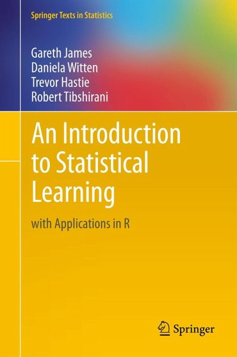

# Statistical Learning Part 1

**organised by [Vancouver School of AI](https://www.facebook.com/groups/991378534367193/)**

**Date: 9 October 2018**

## Installation Requirements

Instead of working in R, as in the book, we will do the applications in Python.

It is recommended that you use either [Google Colab](https://colab.research.google.com/notebooks/welcome.ipynb#recent=true) or [Jupyter Notebook](http://jupyter.org/).

## Meetup Content

[Statistical Learning Part 1](https://docs.google.com/presentation/d/1WqFxIoNZKBtEZS0imJrgFSrVgSLxVZMAowCkly58QzM/edit?usp=sharing)

[Google Colab: Introduction to Python](https://colab.research.google.com/drive/1YvwC6fj_Qj7W2TUn3qEaITcCLOH84_CN)

## Resources

The meetup covers Chapter 1 and 2 from the book, *An Introduction to Statistical Learning*. The book can be downloaded [here](http://www-bcf.usc.edu/~gareth/ISL/ISLR%20Seventh%20Printing.pdf), but has been added to this repo, [here](https://github.com/SchoolofAI-Vancouver/statistical_learning_1/blob/master/docs/An%20Introduction%20to%20Statistical%20Learning%20-%20Gareth%20James.pdf), for convenience.

The book gives R application code snippets. However, we will be working in Python. The Python code snippets for the book can be found [here](https://github.com/JWarmenhoven/ISLR-python).

## Content Authors

The core content was created by the authors of *An Introduction to Statistical Learning*.

Chapters 1 and 2, the focus of this meetup, has been summarised by:

[Akshi Chaudhary](https://github.com/akshi8)

[Johannes Harmse](https://github.com/johannesharmse)

[Xinbin Huang](https://github.com/xinbinhuang)

